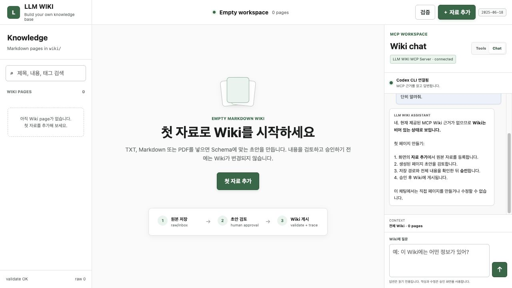

# LLM WIKI

LLM WIKI is an empty, local-first workspace that turns your own Markdown, text, or PDF material into a reviewed and sourced Markdown Wiki. Clone it, add one file, approve the generated draft, and inspect the result in the browser. No API key or prebuilt knowledge base is included.



An example of a Wiki created with the same tool is available at [demo/usage-example.png](demo/usage-example.png). The example content is not loaded into the public workspace.

## What You Get

- `raw/`: pending and processed source materials
- `wiki/`: your Markdown knowledge base, empty on first run
- `schema/`: domain-neutral page schema and template
- `tools/mcp_server.py`: a real stdio MCP server with 12 Wiki tools
- `skills/wiki-curator/`: a reusable import, review, linking, and validation workflow
- `app/`: a browser viewer and three-step import flow
- optional in-app Chat backed by an installed Codex CLI

The distinctive workflow is:

```text
source file → local extraction → schema draft → human approval → Wiki page → source trace + validation
```

Drafting never changes the Wiki. Publishing requires a visible user action or explicit Agent approval.

## First Page In 30 Minutes

### 1. Run

Python 3.10 or newer is required.

```bash
git clone <your-repository-url>
cd llm-wiki
python3 run.py
```

`run.py` creates `.venv`, installs `pypdf`, starts the MCP-backed local server, selects another port if `8000` is busy, and opens the browser.

To start without opening a browser:

```bash
python3 run.py --no-open
```

### 2. Add One Source

1. Select **첫 자료 추가**.
2. Choose one `.md`, `.txt`, or text-based `.pdf` under 10 MB.
3. Choose a page type and optional title and tags.
4. Review the complete Markdown draft and target path.
5. Select **승인하고 Wiki에 저장**.
6. Open the page and inspect **출처** and **검증**.

The source is first stored under `raw/inbox/`. On approval it moves to `raw/processed/`, the page is written under `wiki/`, and the full knowledge base is validated.

Scanned PDFs need OCR before import because they contain no extractable text.

## Page Model

Supported page types:

- `note`: general captured knowledge
- `concept`: definitions and connected ideas
- `guide`: reusable procedures
- `reference`: factual source material
- `project`: project context and decisions
- `journal`: chronological observations

Every page requires frontmatter and these headings:

```markdown
## Summary
## Key Points
## Source
## Related Pages
## User Questions
## Maintenance Notes
```

See `schema/wiki-page.schema.json` and `schema/page-template.md` for the complete contract.

## MCP Tools

| Tool | Behavior |
| --- | --- |
| `list_pages` | List all Wiki pages and metadata. |
| `search_wiki` | Search titles, content, tags, and metadata. |
| `read_page` | Read one complete Markdown page. |
| `page_summary` | Return summary, key points, and metadata. |
| `suggest_links` | Find related existing pages. |
| `list_raw_items` | List pending and processed source files. |
| `store_raw_item` | Store one base64 MD, TXT, or PDF source safely. |
| `read_raw_item` | Extract source text without changing the Wiki. |
| `draft_page_from_raw` | Produce a schema-compliant non-writing draft. |
| `source_trace` | Trace a Wiki page to its raw source. |
| `validate_wiki` | Check metadata, sections, dates, sources, links, and titles. |
| `upsert_page` | Publish an approved page and finalize its source. |

Start the MCP server directly with:

```bash
.venv/bin/python tools/mcp_server.py
```

Use `mcp-config.example.json` as the host configuration template. The GUI itself uses this same stdio MCP server through a subprocess.

## Optional In-App Chat

The right panel includes `Tools / Chat` tabs. When the `codex` command is available, Chat works automatically:

1. The server searches the current Wiki through MCP read tools.
2. The selected page and up to four related summaries are supplied as evidence.
3. Codex CLI writes a Korean answer in a `read-only` ephemeral subprocess.
4. Source buttons in the answer open the supporting Wiki pages.

Chat cannot publish or edit pages. Requests to change knowledge are redirected to the visible import or edit approval flow. No API key is stored in this repository; Codex CLI uses the user's own local installation and configuration.

Without Codex CLI, the Wiki, MCP tools, import pipeline, and viewer continue to work normally. An external MCP-capable Agent can connect using `mcp-config.example.json`.

Example Agent request:

```text
Use the Wiki Curator Skill and LLM WIKI MCP tools.
Import raw/inbox/my-notes.txt as a concept page.
Show the complete draft and target path first.
Do not publish until I approve it.
After publishing, run source_trace and validate_wiki.
```

## Validation

```bash
python3 run.py --check
.venv/bin/python -m unittest discover -s tests -p "test_*.py"
.venv/bin/python tests/mcp_smoke.py
```

Expected on a clean clone:

- `0 pages, 12 MCP tools`
- `validate_wiki` returns `ok: true`
- unit, integration, raw-pipeline, and MCP smoke tests pass

## Privacy And Publishing

- Source extraction and Wiki storage happen locally.
- No LLM service, API key, or account is required.
- In-app Chat is optional and appears only when Codex CLI is already installed.
- Raw user files are ignored by Git; only `.gitkeep` placeholders are published.
- Remove secrets, identity documents, payment data, and private addresses before import.
- `archive3/`, virtual environments, caches, ZIP files, and personal material are excluded from Git.
